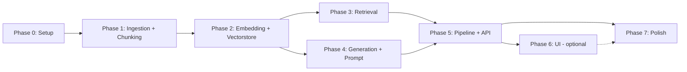

# DOCS — Tài liệu triển khai chi tiết theo Phase

Thư mục này chứa tài liệu chi tiết cho từng giai đoạn (phase) của dự án **RAG cho ebook PDF kỹ thuật**, bám theo [SPEC.md](./SPEC.md) — mục 8 (Roadmap MVP).

## Bảng tổng quan

| Phase | File | Nội dung | Output | Phụ thuộc | Ước tính |
|---|---|---|---|---|---|
| 0 | [PHASE_0_setup.md](PHASE_0_setup.md) | Setup repo, môi trường `uv`, Ollama, config | Repo skeleton, `uv run pytest` pass | — | 0.5 ngày |
| 1 | [PHASE_1_ingestion_chunking.md](PHASE_1_ingestion_chunking.md) | Parse PDF + chunking giữ code block | `pdf → list[Chunk]`, có test | 0 | 1–1.5 ngày |
| 2 | [PHASE_2_embedding_vectorstore.md](PHASE_2_embedding_vectorstore.md) | Ollama embedding client + Chroma store | Index 1 PDF vào Chroma | 1 | 1 ngày |
| 3 | [PHASE_3_retrieval.md](PHASE_3_retrieval.md) | Ghép embedding + vectorstore | `question → list[RetrievedChunk]` | 2 | 0.5 ngày |
| 4 | [PHASE_4_generation_prompt.md](PHASE_4_generation_prompt.md) | DeepSeek client + prompt template | `context + question → answer` | 2 | 1 ngày |
| 5 | [PHASE_5_pipeline_api.md](PHASE_5_pipeline_api.md) | 2 pipeline + FastAPI | API `/query` trả lời có citation | 3, 4 | 1.5 ngày |
| 6 | [PHASE_6_ui.md](PHASE_6_ui.md) | Streamlit demo (**optional**) | Demo trực quan | 5 | 0.5–1 ngày |
| 7 | [PHASE_7_polish.md](PHASE_7_polish.md) | README, logging, error handling, polish | Sẵn sàng trình bày | 5 (hoặc 6) | 1 ngày |

**Tổng ước tính: ~7–9 ngày** (làm buổi tối, có thể dồn nhanh hơn).

## Sơ đồ phụ thuộc



> **Lưu ý:** Phase 3 và Phase 4 độc lập nhau (cùng phụ thuộc Phase 2) → có thể làm song song.

## Quy ước chung (áp dụng mọi phase)

1. **Quản lý môi trường & dependency chỉ dùng `uv`** — không dùng `pip`/`venv`/`poetry`:
   - Thêm dependency: `uv add <pkg>` / `uv add --dev <pkg>` (không sửa tay `pyproject.toml`)
   - Chạy code, test, lint, build: luôn qua `uv run ...`
2. **Kết thúc mỗi phase / trước mỗi commit** phải chạy đủ 3 lệnh và pass:
   ```bash
   uv run ruff check --fix .
   uv run ruff format .
   uv run pytest
   ```
3. **Ngôn ngữ:** code, comment, tên biến/hàm/class viết **tiếng Anh**; tài liệu (DOCS, README, commit message) có thể viết tiếng Việt.
4. **Dependency injection:** mọi module nhận dependency ngoài (Ollama, DeepSeek, vector store) qua constructor/tham số → test được bằng mock/fake (SPEC mục 6).
5. **Unit test không gọi network thật** (Ollama/DeepSeek). Test cần service thật đánh dấu `@pytest.mark.integration` (SPEC mục 6).
6. **Mỗi phase chỉ chuyển tiếp khi hoàn thành Definition of Done (DoD)** — mỗi file phase có checklist riêng ở cuối; tick vào đó để theo dõi.
7. File `.env` (chứa `DEEPSEEK_API_KEY`) **không bao giờ commit**; chỉ commit `.env.example`.

## Cách dùng tài liệu này

- Làm tuần tự: **0 → 1 → 2 → 3/4 (song song) → 5 → (6) → 7**.
- Mỗi file phase gồm 5 phần: Mục tiêu → Công việc chi tiết (kèm lệnh + code mẫu) → Test chi tiết → Tiêu chí hoàn thành (DoD) → Rủi ro & lưu ý.
- Code mẫu trong tài liệu là **định hướng interface**, không phải bản copy-paste hoàn chỉnh — bám đúng interface trong SPEC mục 5.
