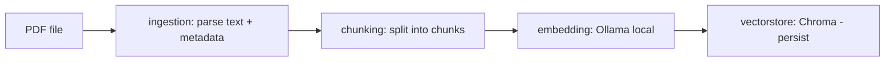

# Spec: Hệ thống RAG cho Tài liệu Kỹ thuật (PDF Tiếng Anh) — MVP

**Phiên bản:** 0.1 (draft)
**Đối tượng:** Đồ án cá nhân / học tập ML-AI Engineer
**Ngày:** 2026-08-18

---

## 1. Tổng quan

Xây dựng một hệ thống RAG (Retrieval-Augmented Generation) cho phép người dùng upload các ebook công nghệ dạng PDF (tiếng Anh), sau đó đặt câu hỏi (tiếng Anh) và nhận câu trả lời có trích dẫn nguồn (trang, đoạn) dựa trên nội dung tài liệu.

**Mục tiêu MVP:**
- Ingest 1 hoặc nhiều PDF kỹ thuật (có thể chứa code block, bảng, hình).
- Trả lời câu hỏi bằng tiếng Anh, có trích dẫn (citation) tới trang/chunk gốc.
- Chạy được local (embedding qua Ollama) + gọi API cloud cho phần generation (DeepSeek).
- Codebase chia module rõ ràng, mỗi module có unit test độc lập.

**Ngoài phạm vi MVP (v2+):** multi-user, auth, streaming UI nâng cao, re-ranking model riêng, OCR cho scanned PDF, hỗ trợ đa ngôn ngữ, fine-tune embedding.

---

## 2. Yêu cầu

### 2.1 Functional requirements

| # | Yêu cầu |
|---|---|
| F1 | Upload/ingest file PDF, parse text + giữ metadata (số trang, tên file) |
| F2 | Chunk văn bản theo chiến lược phù hợp với tài liệu kỹ thuật (giữ code block nguyên vẹn nếu có thể) |
| F3 | Sinh embedding local qua Ollama, lưu vào vector store |
| F4 | Nhận câu hỏi tiếng Anh, retrieve top-k chunk liên quan |
| F5 | Gọi DeepSeek API để sinh câu trả lời dựa trên context retrieve được |
| F6 | Trả về answer kèm citation (nguồn: file, trang, chunk id) |
| F7 | CLI hoặc API endpoint để chạy toàn bộ pipeline (ingest, query) |

### 2.2 Non-functional requirements

- **Chi phí:** embedding chạy local (miễn phí), chỉ tốn chi phí cho LLM generation qua DeepSeek API.
- **Khả năng test:** mỗi module test độc lập được (mock được dependency ngoài — Ollama, DeepSeek).
- **Khả năng mở rộng:** vector store và LLM provider phải thay được qua interface (không hard-code).
- **Reproducibility:** pin version thư viện, config qua file `.env` / `config.yaml`.
- **Độ trễ chấp nhận được cho MVP:** không yêu cầu real-time streaming bắt buộc (nice-to-have).

---

## 3. Tech stack

| Thành phần | Lựa chọn | Lý do |
|---|---|---|
| Ngôn ngữ | Python 3.12+ | hệ sinh thái AI/ML tốt nhất |
| Quản lý package & môi trường | **`uv`** | nhanh, quản lý venv + dependency + lock file trong 1 tool, dùng luôn để chạy test và build |
| PDF parsing | **PyMuPDF (`fitz`)** | nhanh, giữ layout tốt, lấy được số trang/font-size để tách heading; thay thế bằng `pdfplumber` nếu cần bảng chính xác hơn |
| Chunking | `langchain-text-splitters` (RecursiveCharacterTextSplitter) hoặc custom splitter theo heading | cân bằng giữa tốc độ làm và chất lượng; có thể tự viết để học sâu hơn |
| Embedding (local) | **Ollama** + model `qwen3-embedding:0.6b` (1024-dim, context 32k, đa ngôn ngữ 100+ gồm ngôn ngữ lập trình, instruction-aware) — có thể đổi `qwen3-embedding:4b`/`:8b` nếu cần chất lượng cao hơn | chạy local, miễn phí, riêng tư |
| Vector store | **ChromaDB** (embedded, persist local) | setup đơn giản cho MVP, đủ tốt tới ~vài trăm nghìn chunk; dễ nâng cấp lên Qdrant/pgvector sau |
| LLM (cloud) | **DeepSeek API** — model `deepseek-v4-flash` (mặc định, rẻ, 1M context) | endpoint OpenAI-compatible tại `api.deepseek.com`, dùng SDK `openai` <cite index="17-1">DeepSeek API hỗ trợ OpenAI SDK, gọi qua base_url "https://api.deepseek.com" với model như "deepseek-v4-pro"</cite>. Lưu ý: các alias cũ `deepseek-chat`/`deepseek-reasoner` đã bị khai tử, dùng thẳng tên model `deepseek-v4-flash` / `deepseek-v4-pro`. |
| Orchestration | **Tự viết (raw Python), không dùng LangChain/LlamaIndex cho pipeline chính** | vì mục tiêu học tập + dễ test từng module; có thể thêm LangChain sau nếu cần adapter nhanh |
| Backend API | **FastAPI** | async tốt, tự sinh OpenAPI docs, dễ test với `TestClient` |
| UI (optional MVP) | **Streamlit** | dựng nhanh UI demo, không cần frontend riêng |
| Testing | **pytest** + `pytest-mock` / `unittest.mock` | chuẩn cộng đồng Python |
| Config | `pydantic-settings` + `.env` | validate config, tách secret khỏi code |
| Containerization (optional) | Docker + docker-compose (service Ollama + app) | dễ reproduce môi trường |

### 3.1 Workflow với `uv`

Toàn bộ vòng đời môi trường ảo, dependency, chạy test và build package đều dùng `uv` (không dùng `pip`/`venv`/Poetry riêng lẻ):

```bash
# Khởi tạo project (chạy 1 lần)
uv init rag_ebook
cd rag_ebook

# Tạo virtual environment (uv tự tạo .venv, dùng đúng Python 3.12+)
uv venv --python 3.12

# Thêm dependency (tự cập nhật pyproject.toml + uv.lock)
uv add fastapi pydantic-settings chromadb pymupdf openai
uv add --dev pytest pytest-mock mypy

# Cài đặt/đồng bộ toàn bộ dependency theo lock file (dùng khi clone repo mới hoặc CI)
uv sync

# Chạy code / script trong venv mà không cần activate thủ công
uv run python -m src.pipeline.index_pipeline

# Chạy test
uv run pytest
uv run pytest tests/unit            # chỉ unit test
uv run pytest -m integration        # chỉ integration test

# Build package (khi cần đóng gói/deploy)
uv build
```

`uv.lock` được commit vào repo để đảm bảo môi trường reproducible giữa các máy/CI. File `pyproject.toml` là nguồn khai báo dependency chính; không cần `requirements.txt` song song.

> **Lưu ý về chi phí DeepSeek:** giá theo token, có cache prefix giúp giảm chi phí đáng kể khi system prompt lặp lại — phù hợp vì RAG luôn có cùng system prompt cố định.

---

## 4. Kiến trúc tổng thể

### 4.1 Luồng Indexing (offline / khi upload tài liệu)



### 4.2 Luồng Query (khi người dùng hỏi)


---

## 5. Chia module

Cấu trúc thư mục đề xuất:

```
rag_ebook/
├── src/
│   ├── ingestion/
│   │   ├── pdf_loader.py
│   │   └── __init__.py
│   ├── chunking/
│   │   ├── splitter.py
│   │   └── __init__.py
│   ├── embedding/
│   │   ├── ollama_client.py
│   │   └── __init__.py
│   ├── vectorstore/
│   │   ├── chroma_store.py
│   │   └── __init__.py
│   ├── retrieval/
│   │   ├── retriever.py
│   │   └── __init__.py
│   ├── generation/
│   │   ├── deepseek_client.py
│   │   ├── prompt_templates.py
│   │   └── __init__.py
│   ├── pipeline/
│   │   ├── index_pipeline.py
│   │   ├── query_pipeline.py
│   │   └── __init__.py
│   ├── api/
│   │   ├── main.py           # FastAPI app
│   │   ├── schemas.py
│   │   └── __init__.py
│   ├── ui/
│   │   └── streamlit_app.py
│   └── config.py
├── tests/
│   ├── unit/
│   │   ├── test_pdf_loader.py
│   │   ├── test_splitter.py
│   │   ├── test_ollama_client.py
│   │   ├── test_chroma_store.py
│   │   ├── test_retriever.py
│   │   └── test_deepseek_client.py
│   ├── integration/
│   │   └── test_end_to_end_pipeline.py
│   └── fixtures/
│       └── sample_tech_ebook.pdf   # PDF nhỏ dùng cho test
├── data/                # thư mục chứa chroma persist, tách khỏi git
├── .env.example
├── pyproject.toml
└── README.md
```

### 5.1 Module `ingestion`

- **Trách nhiệm:** đọc PDF, trích text theo từng trang, giữ metadata (tên file, số trang, có thể cả heading nếu detect được qua font-size).
- **Interface đề xuất:**
  ```python
  class Document(BaseModel):
      text: str
      page_number: int
      source_file: str


  def load_pdf(path: str) -> list[Document]: ...
  ```
- **Test:** dùng 1 PDF mẫu nhỏ (2-3 trang, có 1 đoạn code) trong `tests/fixtures/`; assert số trang đúng, text không rỗng, ký tự đặc biệt không bị vỡ encoding.

### 5.2 Module `chunking`

- **Trách nhiệm:** cắt `Document` thành các `Chunk` với độ dài phù hợp (ví dụ 500-800 token, overlap 50-100 token), cố gắng không cắt giữa code block.
- **Interface:**
  ```python
  class Chunk(BaseModel):
      chunk_id: str
      text: str
      page_number: int
      source_file: str


  def split_documents(docs: list[Document], chunk_size: int, overlap: int) -> list[Chunk]: ...
  ```
- **Test:** input văn bản giả lập có đoạn code dài; assert chunk không vượt quá `chunk_size`, assert overlap đúng, assert metadata (page, source) được giữ nguyên qua mỗi chunk.

### 5.3 Module `embedding`

- **Trách nhiệm:** wrapper gọi Ollama local API (`/api/embeddings`) để sinh vector cho text; thêm task instruction cho phía query.
- **Interface:**
  ```python
  class EmbeddingClient(Protocol):
      def embed(self, texts: list[str]) -> list[list[float]]: ...
      def embed_query(self, text: str) -> list[float]: ...


  class OllamaEmbeddingClient:
      def __init__(
          self,
          model: str = "qwen3-embedding:0.6b",
          host: str = "http://localhost:11434",
          query_instruction: str = "Given a web search query, retrieve relevant passages that answer the query",
      ): ...
      def embed(self, texts: list[str]) -> list[list[float]]: ...
      def embed_query(self, text: str) -> list[float]: ...
  ```
- Dùng `Protocol`/abstract base để sau này dễ thay bằng embedding provider khác (test dễ mock).
- `qwen3-embedding:0.6b` là model **instruction-aware** (1024-dim, context 32k): phía query nên prepend `Instruct: <query_instruction>\nQuery: <text>` để tăng chất lượng retrieval 1–5%; phía document/chunk **không** cần prefix → tách riêng `embed()` (dành cho chunk/document) và `embed_query()` (dành cho câu hỏi).
- **Test:** mock HTTP call tới Ollama (dùng `responses` hoặc `pytest-mock`), assert client gửi đúng payload (model `qwen3-embedding:0.6b`, vector 1024-dim), assert `embed_query()` có prefix instruction, xử lý đúng lỗi khi Ollama không chạy (connection error → raise exception rõ ràng, không crash im lặng).

### 5.4 Module `vectorstore`

- **Trách nhiệm:** lưu & truy vấn vector trong ChromaDB (persist local), CRUD theo collection (mỗi tài liệu hoặc mỗi project 1 collection).
- **Interface:**
  ```python
  class VectorStore(Protocol):
      def add(self, chunks: list[Chunk], embeddings: list[list[float]]) -> None: ...
      def query(self, query_embedding: list[float], top_k: int) -> list[RetrievedChunk]: ...


  class ChromaVectorStore: ...
  ```
- **Test:** dùng Chroma in-memory (không persist ra disk khi test) hoặc temp dir; add vài chunk giả, query lại và assert top-1 đúng theo similarity kỳ vọng (dùng vector đơn giản, dễ kiểm chứng bằng tay).

### 5.5 Module `retrieval`

- **Trách nhiệm:** kết hợp `embedding` + `vectorstore` để nhận câu hỏi → trả về top-k chunk liên quan nhất (có thể thêm bước lọc/threshold similarity).
- **Interface:**
  ```python
  def retrieve(
      question: str, embedder: EmbeddingClient, store: VectorStore, top_k: int = 5
  ) -> list[RetrievedChunk]: ...
  ```
- **Test:** inject fake `EmbeddingClient` và fake `VectorStore` (test double), assert `retrieve` gọi đúng thứ tự, trả về đúng số lượng kết quả, xử lý đúng khi store rỗng.

### 5.6 Module `generation`

- **Trách nhiệm:** build prompt (system + context + question), gọi DeepSeek API, parse response thành answer + citation.
- **Interface:**
  ```python
  class LLMClient(Protocol):
      def generate(self, system_prompt: str, user_prompt: str) -> str: ...


  class DeepSeekClient:
      def __init__(self, api_key: str, model: str = "deepseek-v4-flash"): ...
      def generate(self, system_prompt: str, user_prompt: str) -> str: ...
  ```
- **Prompt template** nên cố định phần system prompt (để tận dụng cache-hit pricing của DeepSeek khi gọi lặp lại) và chỉ thay đổi phần context/câu hỏi ở cuối.
- **Test:** mock response từ DeepSeek API (không gọi API thật trong unit test), assert prompt được build đúng format, assert xử lý lỗi (timeout, rate limit, empty response).

### 5.7 Module `pipeline`

- **Trách nhiệm:** orchestrate các module trên thành 2 pipeline chính:
  - `index_pipeline.run(pdf_path) -> None` (ingestion → chunking → embedding → vectorstore)
  - `query_pipeline.run(question) -> AnswerResult` (retrieval → prompt build → generation)
- **Test:** integration test dùng fake/mock cho embedding + LLM (không cần Ollama/DeepSeek thật chạy trong CI), chạy pipeline end-to-end với PDF mẫu, assert answer object có đủ field (`answer`, `citations`, `used_chunks`).

### 5.8 Module `api`

- **Trách nhiệm:** expose FastAPI endpoints:
  - `POST /documents` — upload & ingest PDF
  - `POST /query` — gửi câu hỏi, nhận answer
  - `GET /health`
- **Test:** dùng `fastapi.testclient.TestClient`, mock pipeline layer, assert status code, response schema (dùng Pydantic schema validate).

### 5.9 Module `ui` (optional cho MVP)

- Streamlit app đơn giản: upload PDF, ô nhập câu hỏi, hiển thị answer + citation. Có thể bỏ qua nếu ưu tiên thời gian, dùng Swagger UI của FastAPI để demo trước.

---

## 6. Testing strategy

| Loại test | Phạm vi | Công cụ |
|---|---|---|
| Unit test | Từng module độc lập, mock mọi dependency ngoài (Ollama, DeepSeek, filesystem khi cần) | `pytest`, `unittest.mock` / `pytest-mock` |
| Integration test | Pipeline đầy đủ với PDF mẫu, có thể mock LLM/embedding hoặc dùng thật (đánh dấu `@pytest.mark.integration` để tách khỏi CI nhanh) | `pytest` markers |
| Contract test (optional) | Đảm bảo `OllamaEmbeddingClient` và `DeepSeekClient` tuân thủ đúng `Protocol` interface | `pytest` + type checking (`mypy`) |
| Manual/eval test | Chạy thử với vài câu hỏi thật, đánh giá chất lượng câu trả lời bằng mắt (v2 có thể tự động hoá bằng RAGAS) | ad-hoc script |

**Nguyên tắc chung:**
- Mọi module đều nhận dependency qua constructor/tham số (dependency injection) → dễ inject fake/mock trong test.
- Test không được gọi network thật (Ollama server, DeepSeek API) trừ integration test được đánh dấu riêng và có thể skip trong CI nếu không có key/service.
- Dùng 1 PDF fixture nhỏ, cố định, commit vào repo (`tests/fixtures/`) để test luôn reproducible.

---

## 7. Cấu hình & biến môi trường

```env
# .env.example
OLLAMA_HOST=http://localhost:11434
OLLAMA_EMBED_MODEL=qwen3-embedding:0.6b

DEEPSEEK_API_KEY=your_key_here
DEEPSEEK_MODEL=deepseek-v4-flash
DEEPSEEK_BASE_URL=https://api.deepseek.com

CHROMA_PERSIST_DIR=./data/chroma
CHUNK_SIZE=700
CHUNK_OVERLAP=100
TOP_K=5
```

---

## 8. Roadmap đề xuất (MVP)

| Giai đoạn | Nội dung | Output |
|---|---|---|
| 0. Setup | Khởi tạo repo bằng `uv init` + `uv venv`, cài Ollama + pull model embedding, `uv add` dependency, cấu hình pytest | Repo skeleton chạy được `uv run pytest` (rỗng) |
| 1. Ingestion + Chunking | Implement 2 module, test đầy đủ | `pdf → list[Chunk]` hoạt động, có test |
| 2. Embedding + Vectorstore | Implement wrapper Ollama, Chroma; test với mock | Index được 1 PDF vào Chroma |
| 3. Retrieval | Ghép embedding + vectorstore, test | `question → list[RetrievedChunk]` |
| 4. Generation + Prompt | Implement DeepSeek client, prompt template, test | `context + question → answer` |
| 5. Pipeline + API | Ghép toàn bộ, expose FastAPI | Gọi API `/query` trả lời đúng, có citation |
| 6. UI (optional) | Streamlit demo | Demo trực quan |
| 7. Polish | README, error handling, logging, .env.example | Sẵn sàng trình bày/báo cáo |

---

## 9. Rủi ro & giới hạn MVP

- **PDF phức tạp** (bảng, hình, code screenshot dạng ảnh) → PyMuPDF chỉ lấy text layer, không OCR; ảnh chứa code sẽ bị bỏ sót (ghi rõ giới hạn này trong README).
- **Chunking cắt giữa code block** có thể làm giảm chất lượng câu trả lời kỹ thuật → cân nhắc custom splitter dựa trên pattern ``` hoặc indent-block nếu có thời gian.
- **Không có re-ranking** ở MVP → độ chính xác retrieval phụ thuộc hoàn toàn vào embedding similarity; có thể thêm cross-encoder rerank ở v2.
- **Chi phí DeepSeek** tuy rẻ nhưng cần theo dõi vì đã áp dụng giá phân theo giờ cao điểm/thấp điểm — nên đọc kỹ trang pricing chính thức trước khi ước tính chi phí cho demo/báo cáo.
- **Không có auth/multi-tenant** — chỉ phù hợp chạy local/demo cá nhân.

---

## 10. Gợi ý mở rộng sau MVP (v2+)

- Thêm re-ranker (ví dụ cross-encoder chạy local qua Ollama hoặc sentence-transformers).
- Đánh giá tự động bằng RAGAS hoặc bộ câu hỏi-đáp tự tạo (faithfulness, answer relevancy).
- Hỗ trợ nhiều PDF cùng lúc với metadata filter (lọc theo tên sách).
- Streaming response từ DeepSeek qua SSE.
- Chuyển vector store sang Qdrant/pgvector nếu dữ liệu lớn.
- Thêm OCR (ví dụ `pytesseract`) cho PDF scan hoặc hình chứa code.