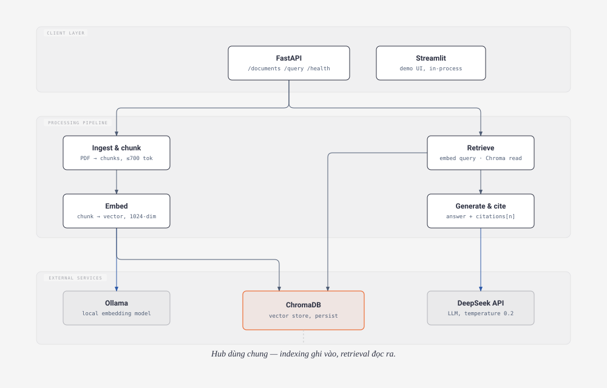

# rag-ebook 📚 — RAG cho ebook PDF kỹ thuật (MVP)

Hệ thống **Retrieval-Augmented Generation (RAG)** cho phép upload ebook kỹ thuật dạng PDF
(tiếng Anh), đặt câu hỏi và nhận câu trả lời **kèm trích dẫn nguồn** (file, trang, chunk id).
Embedding chạy **local miễn phí** qua Ollama; generation gọi **DeepSeek API** (trả phí theo token).

## 1. Tính năng MVP

- **Ingest PDF**: parse text giữ metadata (số trang, tên file) bằng PyMuPDF; chunking giữ nguyên
  code block (custom splitter, không LangChain).
- **Embedding local**: Ollama + `qwen3-embedding:0.6b` (1024-dim, instruction-aware, context 32k),
  có prefix `Instruct: ...` riêng cho phía câu hỏi.
- **Vector store**: ChromaDB persist local, cosine similarity, idempotent re-index (không nhân bản).
- **Retrieval**: `question → top-k chunks` có ngưỡng `min_score` chống context không liên quan
  (cấu hình qua `MIN_SCORE`, mặc định `0.3`; đặt `0.0` để tắt lọc).
- **Generation**: DeepSeek (`deepseek-v4-flash`) với system prompt cố định (tận dụng prefix cache
  giảm chi phí), temperature thấp, answer bám context + citation `[n]`.
- **Giao diện**: FastAPI (ingest/liệt kê/xoá `POST|GET|DELETE /documents`, `POST /query`, `GET /health` — Swagger tại `/docs`) + demo Streamlit.
- 1 hoặc nhiều PDF chung collection `rag_ebook`, lọc theo metadata `source_file`.

## 2. Kiến trúc




```
src/
├── ingestion/    pdf_loader.py      — parse PDF → Document(page_number, source_file)
├── chunking/     splitter.py        — Document → Chunk (giữ code block, overlap)
├── embedding/    ollama_client.py   — EmbeddingClient + OllamaEmbeddingClient
├── vectorstore/  chroma_store.py    — VectorStore + ChromaVectorStore, RetrievedChunk
├── retrieval/    retriever.py       — retrieve(question, embedder, store, top_k, min_score)
├── generation/   deepseek_client.py, prompt_templates.py
├── pipeline/     index_pipeline.py, query_pipeline.py
├── api/          main.py, schemas.py — FastAPI (create_app factory + DI)
├── ui/           streamlit_app.py   — demo Streamlit (gọi thẳng pipeline layer)
├── errors.py                        — hệ thống exception tập trung
├── logging_config.py                — setup_logging(level từ LOG_LEVEL)
└── config.py                        — pydantic-settings + .env
```

Mọi module nhận dependency ngoài (Ollama, DeepSeek, vector store) qua **constructor/tham số**
(dependency injection) → test được bằng mock/fake, thay provider dễ dàng.

## 3. Cài đặt

**Prerequisites:**

- Python **3.12+** và [`uv`](https://docs.astral.sh/uv/)
- [Ollama](https://ollama.com) đang chạy local, đã pull model embedding:
  ```bash
  ollama pull qwen3-embedding:0.6b
  ```
- API key DeepSeek (đăng ký tại platform.deepseek.com)

**Các bước:**

```bash
git clone <repo-url> && cd rag-ebook
uv sync                          # cài dependency theo uv.lock (reproducible)
cp .env.example .env             # rồi điền DEEPSEEK_API_KEY vào .env
```

## 4. Chạy

### Smoke scripts (từng bước, dùng service thật)

```bash
uv run python scripts/smoke_index.py "path/to/book.pdf"     # parse → chunk → embed → Chroma
uv run python scripts/smoke_retrieve.py "your question"     # retrieve top-k
uv run python scripts/smoke_generate.py                     # 1 lần gọi DeepSeek (tốn vài xu)
uv run python scripts/demo.py                               # 4 câu hỏi mẫu cho báo cáo
```

### FastAPI

```bash
uv run uvicorn src.api.main:app --reload    # Swagger UI: http://127.0.0.1:8000/docs
```

```bash
curl http://127.0.0.1:8000/health

curl -X POST http://127.0.0.1:8000/documents \
  -F "file=@path/to/book.pdf"                # → {"filename": "...", "chunks_indexed": N}

curl http://127.0.0.1:8000/documents
# → {"documents": [{"filename": "...", "chunks": N}, ...]} (rỗng → {"documents": []})

curl -X DELETE http://127.0.0.1:8000/documents/book.pdf
# → {"filename": "book.pdf", "chunks_deleted": N} (chưa index → 404)

curl -X POST http://127.0.0.1:8000/query \
  -H "Content-Type: application/json" \
  -d '{"question": "What is a vector database?", "top_k": 5, "min_score": 0.4}'
# → {"answer": "... [1] ...", "citations": [{"chunk_id": ..., "source_file": ..., "page_number": N, "text": ...}]}
# (top_k / min_score là tùy chọn — bỏ đi sẽ dùng giá trị trong .env)
```

> `GET /documents` liệt kê các file **đã index** (nguồn sự thật là vector store),
> kèm số chunk mỗi file. `DELETE /documents/{file}` xoá toàn bộ chunk của file đó
> khỏi index (trả 404 nếu chưa từng index); bản copy staging trong `data/uploads/`
> không bị đụng tới.

### Streamlit demo (local, không deploy công khai — không có auth)

```bash
uv run streamlit run src/ui/streamlit_app.py    # http://localhost:8501
```

## 5. Test

```bash
uv run pytest                 # toàn bộ: unit + integration (83 test)
uv run pytest -m "not integration"   # chỉ unit test, chạy nhanh
uv run pytest -m integration         # chỉ integration (PDF fixture + Chroma temp, fake embedder/LLM)
```

- **Unit test** mock mọi dependency ngoài (HTTP, OpenAI client) — không gọi Ollama/DeepSeek thật.
- **Integration test** dùng PDF fixture thật + Chroma thật (temp dir) nhưng **fake embedder/LLM** →
  chạy được mọi nơi, kể cả CI. Marker `integration` để tách khỏi CI nếu cần.

## 6. Cấu hình (biến môi trường)

| Biến | Mặc định | Ý nghĩa |
|---|---|---|
| `OLLAMA_HOST` | `http://localhost:11434` | địa chỉ Ollama |
| `OLLAMA_EMBED_MODEL` | `qwen3-embedding:0.6b` | model embedding (1024-dim) |
| `DEEPSEEK_API_KEY` | *(bắt buộc)* | API key DeepSeek (không commit, chỉ `.env`) |
| `DEEPSEEK_MODEL` | `deepseek-v4-flash` | model generation (alias cũ `deepseek-chat`/`deepseek-reasoner` đã khai tử) |
| `DEEPSEEK_BASE_URL` | `https://api.deepseek.com` | endpoint OpenAI-compatible |
| `CHROMA_PERSIST_DIR` | `./data/chroma` | thư mục persist vector store |
| `CHUNK_SIZE` / `CHUNK_OVERLAP` | `700` / `100` | kích thước chunk ước tính theo token |
| `TOP_K` | `5` | số chunk retrieve mặc định |
| `MIN_SCORE` | `0.3` | ngưỡng similarity tối thiểu để giữ chunk (cosine; `0.0` = tắt lọc) |
| `LOG_LEVEL` | `INFO` | `DEBUG`/`INFO`/`WARNING`/`ERROR` |

## 7. Giới hạn đã biết

- **Không OCR**: PDF scan / ảnh chứa code không lấy được text (PyMuPDF chỉ đọc text layer).
- **Không re-ranking** ở MVP — chất lượng retrieval phụ thuộc hoàn toàn embedding similarity.
- **Chunking chưa bảo vệ indent-block** (chỉ bảo vệ fenced code block ``` ... ```).
- **Không multi-user/auth** — chỉ chạy local/demo cá nhân.
- **Chạy local, không container** (bỏ qua Docker ở MVP): cần Ollama + Python trên cùng máy.
- **Chi phí DeepSeek theo giờ cao/thấp điểm** (xem dưới).

### Chi phí DeepSeek (giờ cao điểm / thấp điểm)

DeepSeek tính giá theo khung giờ UTC:

- **Cao điểm (Peak):** `01:00–04:00` và `06:00–10:00` UTC.
- **Thấp điểm (Off-peak):** mọi khung giờ còn lại — giá **giảm đúng một nửa**.

Giá mỗi **1 triệu token** (USD):

| Model | Cache hit (peak) | Cache miss (peak) | Output (peak) | Off-peak |
|---|---|---|---|---|
| `deepseek-v4-flash` | $0.014 | $0.44 | $1.32 | một nửa: $0.007 / $0.22 / $0.66 |
| `deepseek-v4-pro` | $0.044 | $1.32 | $3.96 | một nửa: $0.022 / $0.66 / $1.98 |

> Lưu ý: giờ cao điểm theo UTC — buổi tối VN (UTC+7) thường là **thấp điểm** (giá rẻ hơn),
> nhưng sáng sớm VN (01:00–03:00 UTC) lại là **cao điểm**.

**Ước tính cho buổi demo** (model `deepseek-v4-flash`, giờ thấp điểm, ~30 câu hỏi,
mỗi câu ≈ 2.500 token input — context 5 chunk — + ~300 token output):

| Hạng mục | Lượng token | Giá |
|---|---|---|
| Input (cache miss) | 30 × 2.5k ≈ 75k | 0.075 × $0.22 ≈ **$0.017** |
| System prompt (cache hit) | 30 × 120 ≈ 3.6k | 0.0036 × $0.007 ≈ **$0.00003** |
| Output | 30 × 300 ≈ 9k | 0.009 × $0.66 ≈ **$0.006** |
| **Tổng** | | **≈ $0.023 (~2 xu)** |

→ Chi phí demo không đáng kể; giờ cao điểm chỉ gấp đôi (~4–5 xu). System prompt **cố định**
giúp phần lớn input lặp lại trúng prefix cache (giá rẻ nhất).

## 8. Hướng phát triển v2+

- Re-ranker (cross-encoder) cho retrieval chất lượng hơn.
- Đánh giá tự động bằng RAGAS (faithfulness, answer relevancy).
- Streaming response qua SSE; upload ingest bất đồng bộ (background task + status polling).
- OCR (`pytesseract`) cho PDF scan / ảnh chứa code.
- Nhiều collection theo project, metadata filter theo sách; chuyển Qdrant/pgvector khi dữ liệu lớn.

---

**Tài liệu chi tiết theo phase:** [`DOCS/`](DOCS/README.md) · **Spec:** [`DOCS/SPEC.md`](DOCS/SPEC.md)
